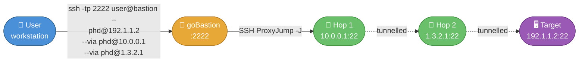
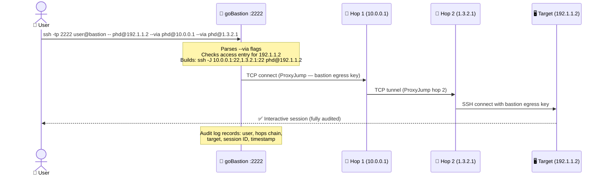

# 🚀 **goBastion**

**goBastion** is a tool for managing SSH access, user roles, and keys on a bastion host. The project is currently under active development, and contributions are welcome!

🔗 **GitHub Repository**: [https://github.com/phd59fr/goBastion](https://github.com/phd59fr/goBastion)

🐳 **Docker Hub Image**: [https://hub.docker.com/r/phd59fr/gobastion](https://hub.docker.com/r/phd59fr/gobastion)

---

## ✨ **Key Concept - Database as the Source of Truth**

In **goBastion**, **the database is the single source of truth** for SSH keys and access management. This means that the system always reflects the state of the database. Any key or access added manually to the system without passing through the bastion will be **automatically removed** to maintain consistency.

### How it works:

* **Key Addition**:
  When a user adds an SSH key, it is first validated and stored in the database. The bastion then automatically synchronizes the database with the system, adding the key to the appropriate location.

* **Automatic Synchronization**:
  The bastion enforces the database state every **5 minutes** automatically. If it finds an SSH key, user, or host entry not in the database, it is immediately corrected to ensure security and consistency. The `--sync` flag allows triggering this on demand.

### **Advantages of this Approach**

* **Centralized Control**: All modifications go through the bastion, ensuring tight access management.
* **Enhanced Security**: Unauthorized keys cannot remain on the system.
* **State Consistency**: The system always mirrors the database state.
* **Audit and Traceability**: Every change is recorded in the database.
* **Fully Automated Management**: No need for manual checks; synchronization handles everything.
* **Easy Exportability**: The system can be deployed on a new container effortlessly. Since the database is the source of truth, replicating it with synchronization scripts provides a functional bastion on a new instance.

---

## 🔍 **Features Overview**

### 👤 **Self-Commands (Manage Your Own Account)**

| Command                          | Description                                                                  |
|----------------------------------|------------------------------------------------------------------------------|
| 🔑 `selfListIngressKeys`         | List your ingress SSH keys (keys for connecting to the bastion).             |
| ➕ `selfAddIngressKey`            | Add a new ingress SSH key (optional expiry).                                 |
| ❌ `selfDelIngressKey`            | Delete an ingress SSH key.                                                   |
| 🔑 `selfListEgressKeys`          | List your egress SSH keys (keys for connecting from the bastion to servers). |
| 🔑 `selfGenerateEgressKey`       | Generate a new egress SSH key.                                               |
| 📋 `selfListAccesses`            | List your personal server accesses.                                          |
| ➕ `selfAddAccess`                | Add access to a personal server (supports IP restriction, TTL, protocol).    |
| ❌ `selfDelAccess`                | Remove access to a personal server.                                          |
| 📋 `selfListAliases`             | List your personal SSH aliases.                                              |
| ➕ `selfAddAlias`                 | Add a personal SSH alias.                                                    |
| ❌ `selfDelAlias`                 | Delete a personal SSH alias.                                                 |
| 📋 `selfListDBAccesses`          | List your personal database accesses.                                        |
| ➕ `selfAddDBAccess`              | Add a personal database access (host, protocol, credentials, TTL, CIDR).     |
| ❌ `selfDelDBAccess`              | Remove a personal database access.                                           |
| 📋 `selfListDBAliases`           | List your personal database aliases.                                         |
| ➕ `selfAddDBAlias`               | Add a personal database alias.                                               |
| ❌ `selfDelDBAlias`               | Delete a personal database alias.                                            |
| ❌ `selfRemoveHostFromKnownHosts` | Remove a host from your known\_hosts file.                                   |
| 🔄 `selfReplaceKnownHost`        | Trust a new host key after it changed (TOFU reset).                          |
| 🔐 `selfSetupTOTP`               | Enable TOTP two-factor authentication (generates QR/OTP URI).                |
| 🔐 `selfDisableTOTP`             | Disable TOTP two-factor authentication.                                      |
| 🔑 `selfSetPassword`             | Set a password second factor (MFA). Required at every login if set.          |
| 🔑 `selfChangePassword`          | Change your password second factor.                                          |
| 🔑 `selfDisablePassword`         | Disable password second factor (MFA).                                        |
| 🛡️ `selfAddIngressKeyPIV`       | Add a PIV/YubiKey hardware-attested ingress key.                             |
| 🔐 `selfGenerateBackupCodes`     | Generate TOTP backup codes (single-use recovery codes).                     |
| 🔐 `selfShowBackupCodeCount`     | Show remaining backup codes count.                                          |

---

### 🦸 **Admin Commands (Manage Other Accounts)**

| Command                     | Description                                           |
|-----------------------------|-------------------------------------------------------|
| 📋 `accountList`            | List all user accounts.                               |
| ℹ️ `accountInfo`            | Show detailed information about a user account.       |
| ➕ `accountCreate`           | Create a new user account (supports `--osh-only` and `--superowner`). |
| ❌ `accountDelete`           | Delete a user account.                                |
| ✏️ `accountModify`          | Modify a user account (role, `--oshOnly`, `--superOwner`). Cannot demote the last remaining admin. |
| 🔑 `accountListIngressKeys` | List the ingress SSH keys of a user.                  |
| 🔑 `accountListEgressKeys`  | List the egress SSH keys of a user.                   |
| 📋 `accountListAccess`      | List all server accesses of a user.                                          |
| ➕ `accountAddAccess`        | Grant a user access to a server (supports IP restriction, TTL, protocol).    |
| ❌ `accountDelAccess`        | Remove a user's access to a server.                                          |
| 📋 `whoHasAccessTo`         | Show all users with access to a specific server (supports CIDR).             |
| 🔐 `accountDisableTOTP`    | Disable TOTP two-factor authentication for a user.                           |
| 🔄 `accountUnexpire`       | Re-enable a disabled account (reactivate after max inactive days lockout).    |
| 🔒 `accountExpire`         | Immediately lock a user account (force disable on departure).                 |
| 🔑 `accountSetPassword`    | *(admin)* Set or clear a user's password second factor.                       |
| 🛡️ `pivAddTrustAnchor`     | Register a Yubico PIV CA certificate as a trust anchor.                      |
| 📋 `pivListTrustAnchors`    | List all registered PIV trust anchor CAs.                                    |
| ❌ `pivRemoveTrustAnchor`   | Remove a PIV trust anchor CA.                                                |
| ⚙️ `bastionConfig`         | Interactive configuration manager (view/edit bastion config stored in DB).    |
| 🔐 `bastionShowSFTPHostKey` | Show the stable public host key used by `sftp-session` for client distribution. |

---

### 🚧 **Restricted Operations**

| Command                     | Description                                           |
|----------------------------|-------------------------------------------------------|
| ➕ `realmCreate`            | Create a trusted realm (`--realm`, `--bastion`, `--port`, `--from`, `--public-key`). |
| 📋 `realmList`              | List configured trusted realms.                       |
| ℹ️ `realmInfo`              | Show details for a trusted realm.                     |
| ❌ `realmDelete`            | Delete a trusted realm.                               |
| ➕ `restrictedGrantAdd`     | Grant a restricted command to a specific user.        |
| ❌ `restrictedGrantDel`     | Remove a restricted command grant from a user.        |
| 📋 `restrictedGrantList`    | List restricted command grants (all or per user).     |

---

### 👥 **Group Management**

| Command                     | Description                                       |
|-----------------------------|---------------------------------------------------|
| ℹ️ `groupInfo`              | Show detailed information about a group (subject to `security.group_visibility.mode`). |
| 📋 `groupList`              | List groups. `--all` availability depends on `security.group_visibility.mode`. |
| ➕ `groupCreate`             | Create a new group.                               |
| ❌ `groupDelete`             | Delete a group.                                   |
| ➕ `groupAddMember`          | Add a user to a group.                            |
| ❌ `groupDelMember`          | Remove a user from a group.                       |
| 🔑 `groupGenerateEgressKey` | Generate a new egress SSH key for the group.      |
| 🔑 `groupListEgressKeys`    | List group egress SSH public keys (subject to `security.egress_key_visibility.mode`). |
| 📋 `groupListAccesses`      | List all accesses assigned to a group (subject to `security.group_visibility.mode`). |
| ➕ `groupAddAccess`          | Grant access to a group (supports protocol restriction and optional `--guest` scope). The optional TCP connectivity check is restricted to private/reserved IP ranges to prevent network scanning. Use `--force` to skip. |
| ❌ `groupDelAccess`          | Remove access from a group.                       |
| 🔐 `groupSetMFA`            | Enable or disable JIT MFA requirement for a group (owner/admin only).       |
| ➕ `groupAddGuestAccess`    | Grant guest access to a specific server in a group (gatekeeper+).            |
| ❌ `groupDelGuestAccess`    | Remove a guest access grant from a group.                                    |
| 📋 `groupListGuestAccesses`| List guest access grants for a user in a group.                              |
| ➕ `groupAddAlias`           | Add a group SSH alias.                            |
| ❌ `groupDelAlias`           | Delete a group SSH alias.                         |
| 📋 `groupListAliases`       | List all group SSH aliases (subject to `security.group_visibility.mode`). |
| 📋 `groupListDBAccesses`    | List all database accesses assigned to a group (subject to `security.group_visibility.mode`). |
| ➕ `groupAddDBAccess`        | Grant database access to a group.                 |
| ❌ `groupDelDBAccess`        | Remove database access from a group.              |
| 📋 `groupListDBAliases`     | List all group database aliases (subject to `security.group_visibility.mode`). |
| ➕ `groupAddDBAlias`         | Add a group database alias.                       |
| ❌ `groupDelDBAlias`         | Delete a group database alias.                    |
| ➕ `groupAddGuestDBAccess`   | Grant guest database access inside a group.       |
| ❌ `groupDelGuestDBAccess`   | Remove a guest database access grant.             |
| 📋 `groupListGuestDBAccesses`| List guest database access grants in a group.     |

> TODO: MongoDB client support is not packaged in the container yet. Current built-in database client support is `mysql`, `postgres`, and `redis`.

---

### 👥 **Guest Access Management**

Guests are users who need **limited, per-server access** to a group's resources. Unlike members (who can connect to all servers in a group), guests can only connect to **specific servers** explicitly granted to them.

**Concept:**
- A user must first be added to a group as a `guest` role via `groupAddMember --role guest`
- Then, gatekeepers/owners grant them access to specific servers via `groupAddGuestAccess`
- The guest uses the **group's egress key** but only on the servers listed in their grants
- Grants can have TTL, protocol restrictions, and IP restrictions — just like regular accesses

**Commands:**

| Command | Description |
|---------|-------------|
| `groupAddGuestAccess` | Grant a guest access to a specific server (host/user/port) |
| `groupDelGuestAccess` | Remove a guest access grant (all or specific grant ID) |
| `groupListGuestAccesses` | List all guest access grants for a user in a group |

**Example workflow:**
```sh
# 1. Add bob as a guest to the "infra" group
groupAddMember --group infra --user bob --role guest

# 2. Grant bob access to db01 (as deploy user, port 22)
groupAddGuestAccess --group infra --account bob --host db01 --user deploy --port 22

# 3. Grant bob temporary access to web01 (expires in 7 days)
groupAddGuestAccess --group infra --account bob --host web01 --user root --port 22 --ttl 7

# 4. List what bob can access in the infra group
groupListGuestAccesses --group infra --account bob

# 5. Remove bob's access to db01
groupDelGuestAccess --group infra --account bob --grant <grant_id>
```

> **Key difference from members:** Members can connect to ALL servers in the group. Guests can only connect to servers explicitly listed in their grants.
>
> **Visibility note:** listing guest grants is also affected by `security.group_visibility.mode`. Even when the group itself is visible, a guest user may inspect only their own grants.

---

### 🔐 **MFA / TOTP (Two-Factor Authentication)**

goBastion supports multiple second-factor authentication methods that stack: password, TOTP, and JIT MFA per group.

#### TOTP

| Command               | Description                                                            |
|-----------------------|------------------------------------------------------------------------|
| `selfSetupTOTP`       | Generate a TOTP secret and display the QR/OTP URI to add to your authenticator app. |
| `selfDisableTOTP`     | Disable TOTP for your own account.                                     |
| `accountDisableTOTP`  | *(admin)* Disable TOTP for any user account.                           |

Once TOTP is enabled, the bastion will prompt for a 6-digit code at every interactive or passthrough login.

#### Backup Codes

Backup codes are single-use recovery codes that can be used instead of a TOTP code when you lose access to your authenticator app.

| Command                     | Description                                              |
|-----------------------------|----------------------------------------------------------|
| `selfGenerateBackupCodes`   | Generate 10 new backup codes. Previous codes are invalidated. |
| `selfShowBackupCodeCount`   | Show how many backup codes remain unused.                |

- Each code can only be used once and is removed after use.
- Backup codes are accepted in the same prompt as TOTP codes (`Enter TOTP code (or backup code):`).
- Generating new codes invalidates all previous codes.

#### Password Second Factor

| Command                  | Description                                                               |
|--------------------------|---------------------------------------------------------------------------|
| `selfSetPassword`        | Set a bcrypt-hashed password as a second factor. Required at every login. |
| `selfChangePassword`     | Change your password second factor (requires current password).           |
| `accountSetPassword`     | *(admin)* Set or clear a user's password second factor.                   |

Password MFA is independent of TOTP — both can be active simultaneously.

#### JIT MFA (per-group)

When a group has JIT MFA enabled via `groupSetMFA`, any user connecting via that group must pass a TOTP challenge at connection time, even if global TOTP is not enabled for their account. The user must have a TOTP secret configured (`selfSetupTOTP`) for this to work.

| Command         | Description                                              |
|-----------------|----------------------------------------------------------|
| `groupSetMFA`   | *(owner/admin)* Enable or disable JIT MFA for a group.                   |

---

### 📡 **SCP / SFTP / rsync Passthrough**

goBastion supports two passthrough modes depending on whether you need to use the bastion's egress key (recommended) or your own key on the target.

#### Mode 1 — sftp-session (recommended, uses bastion's egress key)

goBastion acts as a minimal SSH server and connects to the target with its own egress key. **Your local key does not need to be on the target server.**

This mode now uses a **stable per-instance SSH host key** for the fake in-band SFTP server. Administrators should distribute that public key to client teams exactly like any other SSH host key.

##### Admin workflow

1. Display the stable SFTP proxy host key from the bastion:

```sh
ssh -tp 2222 admin@bastion -- bastionShowSFTPHostKey
```

2. Copy the displayed public key (or fingerprint) into your internal client documentation / configuration management.

3. Ask client teams to pin that key in `known_hosts` for the **SSH host alias they invoke in their local client config**.
This is usually the final `Host my-server` alias used with `sftp my-server`, not the bastion hostname inside `ProxyCommand`.

4. If you need to rotate the key, regenerate it explicitly:

```sh
docker exec -it goBastion /app/goBastion --regenerateSFTPProxyHostKey
```

After rotation, redistribute the new public key before asking clients to reconnect.

##### Client-side `known_hosts`

If clients run `sftp my-server`, they should usually pin the key under `my-server`:

```known_hosts
my-server ssh-ed25519 AAAAC3NzaC1lZDI1NTE5AAAA...
```

If they instead connect through another client-side alias, they should pin the key under that alias:

```known_hosts
my-server-prod ssh-ed25519 AAAAC3NzaC1lZDI1NTE5AAAA...
```

##### Client-side `ssh_config`

```ssh-config
Host my-server
    HostName 192.168.1.10
    User myuser
    ProxyCommand ssh -p 2222 -- bastion_user@bastion.example.com "sftp-session myuser@%h:%p"
```

Then use SFTP normally:

```sh
sftp my-server
```

##### Operational notes

- The bastion user in `ProxyCommand` is the **ingress account on goBastion**.
- The `myuser@%h:%p` part is the **target account on the destination server**.
- The host key presented by `sftp-session` is verified against the **client-side SSH host alias** being opened by the SFTP client.
- Because the SFTP proxy host key is now stable, you should **not** use `StrictHostKeyChecking no` or `UserKnownHostsFile /dev/null` anymore.
- Rotating the SFTP proxy host key invalidates the previously pinned client entry. Treat it like any other SSH host key rotation.

#### Mode 2 — TCP proxy (requires your key on the target)

Passes `-W %h:%p` **as a quoted string** after `--` so glibc does not treat it as a native SSH flag:

```ssh-config
Host my-server
    HostName 192.168.1.10
    User myuser
    ProxyCommand ssh -p 2222 -- bastion_user@bastion "-W %h:%p"
```

> **Why `--` before the hostname?**  
> On Linux (glibc), `ssh -W host:port` opens a raw `direct-tcpip` channel that bypasses goBastion's access controls — and is refused by the bastion's sshd.  
> The `--` tells SSH's option parser to stop processing flags, so `-W %h:%p` becomes the **remote exec command** forwarded to goBastion, which handles it as a controlled TCP proxy via `parseTCPProxyRequest`.

This enables:
- `scp file.txt user@my-server:/path/`
- `sftp user@my-server`
- `rsync -avz ./dir/ user@my-server:/path/`

Operational notes:
- This mode requires the client's own SSH key to be trusted directly on the target host.
- This mode is **not suitable when account-level MFA must prompt interactively**. If password MFA, TOTP MFA, or global `require_mfa` are enabled on the bastion account, prefer `sftp-session`.

All passthrough connections are subject to the same access control rules as interactive SSH sessions.

#### Protocol Restriction

Access entries can be restricted to a specific transfer protocol using the `--protocol` flag on `selfAddAccess`, `accountAddAccess`, and `groupAddAccess`:

| Value         | Meaning                                     |
|---------------|---------------------------------------------|
| `ssh`         | All protocols (default, backwards-compatible) |
| `scpupload`   | SCP upload only (`scp -t`)                  |
| `scpdownload` | SCP download only (`scp -f`)                |
| `sftp`        | SFTP only                                   |
| `rsync`       | rsync only                                  |

Example: grant a user rsync-only access to a backup server:
```
groupAddAccess --group backups --server 10.0.0.5 --username backup --protocol rsync
```

---

### ⏱️ **Access TTL and IP Restriction**

Every access entry (`selfAddAccess`, `accountAddAccess`, `groupAddAccess`) supports two optional constraints:

| Flag | Description |
|------|-------------|
| `--ttl <days>` | Access expires automatically after N days. Omit for permanent access. |
| `--from <CIDRs>` | Restrict access to specific source IP ranges (comma-separated, e.g. `10.0.0.0/8,192.168.1.0/24`). Omit to allow all IPs. |

For `groupAddAccess`, you can also add `--guest` to explicitly allow users with the `guest` role
to use that specific access entry. Without `--guest`, guest members are denied for that entry.

Both constraints are enforced at connection time - expired or out-of-range connections are denied.
The `Expires` and `From` columns appear in all `listAccesses` outputs.

### ⏳ **Account Inactivity Lockout (MaxInactiveDays)**

Admins can configure a maximum number of inactive days via `bastionConfig`. If a user hasn't logged in for more than `MaxInactiveDays`, the account is automatically disabled during the sync cycle.

| Config Key | Default | Description |
|------------|---------|-------------|
| `account.max_inactive_days` | `0` (disabled) | Number of days after last login before the account is disabled. Set to `0` to disable this feature. |

- Only accounts with a non-zero `last_login_at` are affected (accounts that have never logged in are left alone).
- Disabled accounts can be re-enabled by an admin using `accountUnexpire`.
- Admins can also **immediately lock** an account using `accountExpire` (e.g. when a collaborator leaves).
- The inactivity check runs during every sync cycle (every 5 minutes by default).

```sh
# Set max inactive days to 90 via the interactive config
ssh -tp 2222 admin@bastion -- bastionConfig
# → Navigate to account.max_inactive_days, Enter, type 90

# Immediately lock a departing collaborator's account
ssh -tp 2222 admin@bastion -- -osh accountExpire --user alice

# Re-enable a locked-out account
ssh -tp 2222 admin@bastion -- -osh accountUnexpire --account alice
```

> **Security note (IP restrictions):** If a `--from` CIDR restriction is set on an access entry
> and the bastion cannot determine the client IP (e.g. missing `SSH_CLIENT`), the connection
> is **denied** (fail-closed policy). This prevents accidental bypass of IP-based access controls.

---

### 🛡️ **Yubico PIV / Hardware Key Attestation**

PIV attestation lets users prove that their SSH private key was generated inside a hardware token
(e.g. YubiKey) and cannot be exported. The full x509 attestation chain is verified against
admin-registered CA certificates before the key is accepted.

**Admin setup:**
```
pivAddTrustAnchor --name yubico-root --cert /path/to/yubico-piv-ca.pem
pivListTrustAnchors
pivRemoveTrustAnchor --name yubico-root
```

**User workflow (YubiKey):**
```bash
# Export attestation data from YubiKey
yubico-piv-tool --action=attest --slot=9a > attest.pem
yubico-piv-tool --action=read-cert --slot=f9 > intermediate.pem
ssh-keygen -D /usr/lib/x86_64-linux-gnu/libykcs11.so -e > my_piv_key.pub

# Add the key to the bastion (chain is verified server-side)
selfAddIngressKeyPIV --attest attest.pem --intermediate intermediate.pem $(cat my_piv_key.pub)
```

Keys added via PIV attestation are marked `PIV` in `selfListIngressKeys`.

---

### 🐚 **Mosh Support**

goBastion can transparently pass through `mosh-server` invocations, enabling [Mosh](https://mosh.org/)
sessions through the bastion when the runtime image includes `mosh`.

The default image is built **without** `mosh` to keep it smaller.
Use the full image variant if you need Mosh support.

```bash
# Standard mosh usage through the full image variant
mosh --ssh="ssh -J user@bastion:2222" user@my-server
```

The bastion detects the `mosh-server` command in `SSH_ORIGINAL_COMMAND` and exec's it directly.
UDP ports 60001-61000 must be open on the **target server** (not the bastion) for the Mosh UDP connection.

---

### 📜 **TTY Session Recording**

| Command      | Description                                                                |
|--------------|-----------------------------------------------------------------------------|
| 📋 `ttyList` | List recorded interactive SSH/DB sessions. |
| ▶️ `ttyPlay` | Replay a recorded interactive SSH/DB session.                                              |

---

### 🔗 **Bastion-to-Bastion Chaining (Multi-Hop SSH)**

goBastion supports transparent multi-hop SSH through one or more intermediate bastions using the `--via` flag.

#### Syntax

```
user@final-target --via user@hop1[:port] [--via user@hop2[:port] ...]
```

- The **first argument** (without a flag) is always the **final target machine**.
- Each `--via` specifies an **intermediate bastion**, in order from outermost to innermost.
- Ports default to `22` if not specified.
- The `--via` flag is intentionally distinct from all SSH flags (no conflict).

#### How it works

goBastion translates the chain to SSH native ProxyJump:

```
phd@192.1.1.2 --via phd@10.0.0.1 --via phd@1.3.2.1
  → ssh -J phd@10.0.0.1:22,phd@1.3.2.1:22 phd@192.1.1.2
```

**Connection topology (two hops):**



**Sequence — what happens step by step:**



#### Prerequisites

1. The bastion must have a valid **access entry** for the final target (`selfAddAccess` or `groupAddAccess`).
2. The bastion's **egress key** must be authorized on each intermediate hop.
3. Each intermediate hop must have the bastion's egress public key in its `authorized_keys`.

#### Examples

**Single intermediate bastion:**
```sh
ssh -tp 2222 user@bastion -- phd@192.168.1.50 --via phd@10.0.0.1
```

**Two intermediate bastions with custom ports:**
```sh
ssh -tp 2222 user@bastion -- phd@192.1.1.2 --via phd@10.0.0.1:2222 --via phd@1.3.2.1
```

**With alias shorthand:**
```sh
alias gobastion='ssh -tp 2222 user@bastion --'
gobastion phd@192.1.1.2 --via phd@10.0.0.1 --via phd@1.3.2.1
```

**Combined with non-interactive command:**
```sh
# Run a command on the final target via two hops
ssh -tp 2222 user@bastion -- phd@192.1.1.2 --via phd@10.0.0.1 ls -la /etc
```

> **Audit**: the full hop chain (`jump_chain`) is recorded in the structured audit log for every multi-hop connection.

---

### 🌐 **Trusted Realms**

Realms are **named, registered intermediate bastions** — a convenient alternative to typing raw IPs in `--via` chains. They also store the trusted public key and allowed source CIDRs for auditing purposes.

> Realms require the `realmCreate` permission (admin, superowner, or restricted grant).

#### Commands

| Command                | Description |
|------------------------|-------------|
| `realmCreate`          | Register a new trusted bastion endpoint. |
| `realmList`            | List all configured realms. |
| `realmInfo`            | Show full details for one realm. |
| `realmDelete`          | Remove a realm entry. |

#### Full Usage

**Register a realm:**
```sh
# Interactive
ssh -tp 2222 user@bastion -- -osh realmCreate \
  --realm eu-bastion \
  --bastion 10.0.0.1 \
  --port 2222 \
  --from 10.0.0.0/8,192.168.0.0/16 \
  --public-key "ssh-ed25519 AAAAC3NzaC1lZDI1NTE5AAAAIB3..."

# JSON output
ssh -tp 2222 user@bastion -- -osh realmList --json-pretty
```

**List realms:**
```sh
ssh -tp 2222 user@bastion -- -osh realmList
```

**Inspect one realm:**
```sh
ssh -tp 2222 user@bastion -- -osh realmInfo --realm eu-bastion
```

**Delete a realm:**
```sh
ssh -tp 2222 user@bastion -- -osh realmDelete --realm eu-bastion
```

#### Using a Realm in a hop chain

Once registered, you can use the realm's `BastionHost` directly with `--via`:
```sh
# The realm "eu-bastion" has BastionHost=10.0.0.1, BastionPort=2222
gobastion deploy@target-server --via deploy@10.0.0.1:2222
```

---

### 👤 **Special Account Roles**

Beyond the standard `user` / `admin` roles, goBastion supports two optional account modifiers settable at creation or modification time.

#### OSH-Only accounts (`--osh-only`)

An OSH-only account can **only run `-osh` commands** — it cannot open interactive SSH sessions or connect to target servers. Ideal for automation accounts, CI pipelines, and API callers.

```sh
# Create an automation account
ssh -tp 2222 admin@bastion -- -osh accountCreate --account ci-bot --osh-only

# Modify an existing account
ssh -tp 2222 admin@bastion -- -osh accountModify --account ci-bot --oshOnly true
```

Behavior:
- Interactive login → denied immediately.
- SSH commands to target servers → denied.
- `-osh selfListAccesses`, `-osh groupList`, etc. → allowed.

#### SuperOwner accounts (`--superowner`)

A SuperOwner account has **implicit owner privileges on every group** without being explicitly added to them. Useful for on-call engineers or senior SREs who need broad visibility.

```sh
# Create a superowner account
ssh -tp 2222 admin@bastion -- -osh accountCreate --account sre-lead --superowner

# Grant superowner to an existing account
ssh -tp 2222 admin@bastion -- -osh accountModify --account sre-lead --superOwner true
```

Behavior:
- Can manage any group (add/remove members, accesses, aliases).
- Can execute all restricted commands (`realmCreate`, `pivAddTrustAnchor`, etc.).
- Does **not** grant admin-level account management (create/delete users) unless the account is also admin.

---

### 🔒 **Restricted Command Grants**

Restricted commands (such as `realmCreate`, `pivAddTrustAnchor`) normally require admin or superowner privileges. Admins can delegate individual restricted commands to specific non-admin users using grants.

> Only admins and superowners can manage grants.

#### Commands

| Command                  | Description |
|--------------------------|-------------|
| `restrictedGrantAdd`     | Grant a restricted command to a user. |
| `restrictedGrantDel`     | Remove a restricted command grant. |
| `restrictedGrantList`    | List all grants (optionally filtered by user). |

#### Examples

```sh
# Allow user "alice" to manage realms without making her an admin
ssh -tp 2222 admin@bastion -- -osh restrictedGrantAdd --user alice --command realmCreate
ssh -tp 2222 admin@bastion -- -osh restrictedGrantAdd --user alice --command realmDelete
ssh -tp 2222 admin@bastion -- -osh restrictedGrantAdd --user alice --command realmList
ssh -tp 2222 admin@bastion -- -osh restrictedGrantAdd --user alice --command realmInfo

# Allow user "bob" to manage PIV trust anchors
ssh -tp 2222 admin@bastion -- -osh restrictedGrantAdd --user bob --command pivAddTrustAnchor
ssh -tp 2222 admin@bastion -- -osh restrictedGrantAdd --user bob --command pivListTrustAnchors

# List all grants
ssh -tp 2222 admin@bastion -- -osh restrictedGrantList

# List grants for a specific user
ssh -tp 2222 admin@bastion -- -osh restrictedGrantList --user alice

# Revoke a grant
ssh -tp 2222 admin@bastion -- -osh restrictedGrantDel --user alice --command realmCreate
```

---

### 📜 **Misc Commands**

| Command   | Description                                    |
|-----------|------------------------------------------------|
| ❓ `help`  | Display the help menu with available commands. |
| ℹ️ `info` | Show application version and details.          |
| 🚪 `exit` | Exit the application.                          |

---

### 🧩 **JSON API over SSH (`-osh`)**

Non-interactive `-osh` commands support machine-readable output formats:

| Flag | Output format |
|------|---------------|
| `--json` | Compact JSON payload between `JSON_START` / `JSON_END` |
| `--json-pretty` | Pretty-printed JSON payload between `JSON_START` / `JSON_END` |
| `--json-greppable` | One-line payload prefixed by `JSON_OUTPUT=` |

Example:
```sh
ssh -p 2222 user@bastion -- -osh groupList --json-pretty
```

---

## 📊 **Permissions Matrix**

### 🔐 **Admin Permissions**

- `accountAddAccess`
- `accountCreate`
- `accountDelAccess`
- `accountDelete`
- `accountInfo`
- `accountList`
- `accountListAccess`
- `accountListIngressKeys`
- `accountListEgressKeys`
- `accountModify`
- `accountSetPassword`
- `whoHasAccessTo`
- `accountDisableTOTP`
- `accountUnexpire`
- `accountExpire`
- `bastionConfig`
- `pivAddTrustAnchor`
- `pivListTrustAnchors`
- `pivRemoveTrustAnchor`
- `groupCreate`
- `groupDelete`
- `realmCreate`
- `realmList`
- `realmInfo`
- `realmDelete`
- `restrictedGrantAdd`
- `restrictedGrantDel`
- `restrictedGrantList`

> **Notes**:
> - `ttyList` and `ttyPlay` are available to all users (for their own sessions) and to admins (for all sessions).
> - Realm and PIV commands can be delegated to non-admin users via `restrictedGrantAdd`.
> - **SuperOwner** accounts have admin-equivalent access to all of the above realm/restricted commands.

### 🛡️ **Restricted Commands (delegatable)**

The following commands require admin or superowner by default, but can be granted to individual users via `restrictedGrantAdd`:

| Command                | Default             | Grantable to regular users |
|------------------------|---------------------|:--------------------------:|
| `realmCreate`          | Admin / SuperOwner  | ✅                         |
| `realmList`            | Admin / SuperOwner  | ✅                         |
| `realmInfo`            | Admin / SuperOwner  | ✅                         |
| `realmDelete`          | Admin / SuperOwner  | ✅                         |
| `pivAddTrustAnchor`    | Admin / SuperOwner  | ✅                         |
| `pivListTrustAnchors`  | Admin / SuperOwner  | ✅                         |
| `pivRemoveTrustAnchor` | Admin / SuperOwner  | ✅                         |

### 👥 **Group Permissions**

| Permission               | Owner | ACLKeeper | GateKeeper | Member | Guest |
| ------------------------ | :---: | :-------: | :--------: | :----: | :---: |
| `groupAddAccess`         | ✅    | ✅        | ✅         |        |       |
| `groupDelAccess`         | ✅    | ✅        | ✅         |        |       |
| `groupAddDBAccess`       | ✅    | ✅        | ✅         |        |       |
| `groupDelDBAccess`       | ✅    | ✅        | ✅         |        |       |
| `groupSetMFA`            | ✅    |           |            |        |       |
| `groupAddGuestAccess`    | ✅    | ✅        | ✅         |        |       |
| `groupDelGuestAccess`    | ✅    | ✅        | ✅         |        |       |
| `groupAddGuestDBAccess`  | ✅    | ✅        | ✅         |        |       |
| `groupDelGuestDBAccess`  | ✅    | ✅        | ✅         |        |       |
| `groupListGuestAccesses` | ✅    | ✅        | ✅         | ✅     | ✅ (own only) |
| `groupListGuestDBAccesses` | ✅  | ✅        | ✅         | ✅     | ✅ (own only) |
| `groupAddMember`         | ✅    | ✅        |            |        |       |
| `groupDelMember`         | ✅    | ✅        |            |        |       |
| `groupGenerateEgressKey` | ✅    |           |            |        |       |
| `groupAddAlias`          | ✅    | ✅        | ✅         |        |       |
| `groupDelAlias`          | ✅    | ✅        | ✅         |        |       |
| `groupAddDBAlias`        | ✅    | ✅        | ✅         |        |       |
| `groupDelDBAlias`        | ✅    | ✅        | ✅         |        |       |
| `groupInfo`              | ✅    | ✅        | ✅         | ✅     | ✅ (`security.group_visibility.mode`) |
| `groupList`              | ✅    | ✅        | ✅         | ✅     | ✅ (`security.group_visibility.mode`) |
| `groupListAccesses`      | ✅    | ✅        | ✅         | ✅     | ✅ (`security.group_visibility.mode`) |
| `groupListAliases`       | ✅    | ✅        | ✅         | ✅     | ✅ (`security.group_visibility.mode`) |
| `groupListDBAccesses`    | ✅    | ✅        | ✅         | ✅     | ✅ (`security.group_visibility.mode`) |
| `groupListDBAliases`     | ✅    | ✅        | ✅         | ✅     | ✅ (`security.group_visibility.mode`) |
| `groupListEgressKeys`    | ✅    | ✅        | ✅         | ✅     | ✅ (`security.egress_key_visibility.mode`) |

### 👤 **Self Permissions**

- `selfAddAccess`
- `selfAddAlias`
- `selfAddDBAccess`
- `selfAddDBAlias`
- `selfAddIngressKey`
- `selfAddIngressKeyPIV`
- `selfChangePassword`
- `selfDelAccess`
- `selfDelAlias`
- `selfDelDBAccess`
- `selfDelDBAlias`
- `selfDelIngressKey`
- `selfDisablePassword`
- `selfDisableTOTP`
- `selfGenerateBackupCodes`
- `selfGenerateEgressKey`
- `selfListAccesses`
- `selfListAliases`
- `selfListDBAccesses`
- `selfListDBAliases`
- `selfListEgressKeys`
- `selfListIngressKeys`
- `selfRemoveHostFromKnownHosts`
- `selfReplaceKnownHost`
- `selfSetPassword`
- `selfSetupTOTP`
- `selfShowBackupCodeCount`
- `ttyList` *(own sessions only)*
- `ttyPlay` *(own sessions only)*

⚠ **Alias Priority Warning**:
If an alias is defined by the user (`selfAddAlias`) and the group defines an alias with the same name (`groupAddAlias`), **the user-defined alias always takes precedence**

The same precedence rule applies to database aliases: `selfAddDBAlias` overrides `groupAddDBAlias` when the alias name is identical.

If the same group alias name exists in multiple groups you belong to, the short alias becomes ambiguous. In that case, use the explicit form `<group>-<alias>` to disambiguate.

The same explicit disambiguation rule applies to database aliases when multiple groups define the same DB alias.

### 📜 **Misc Permissions**

- `help`
- `info`
- `exit`

---

## 📥 **Installation**

1. Clone the repository:

   ```sh
   git clone https://github.com/phd59fr/goBastion.git
   cd goBastion
   ```

2. Build the Docker container:

   ```sh
   docker build -t gobastion .
   ```

   Build the full image variant with Mosh support:

   ```sh
   docker build --target final-full -t gobastion:full .
   ```

3. Run the Docker container:

   ```sh
   docker run --name gobastion --hostname goBastion -it -p 2222:22 gobastion:latest
   ```

   You can also use the official **Docker Hub** image:

   ```sh
   docker run --name gobastion --hostname goBastion -it -p 2222:22 phd59fr/gobastion:latest
   ```

   (optional) 3a. Launch the container with a volume to persist the database and ttyrec:

   ```sh
   docker run --name gobastion --hostname goBastion -it -p 2222:22 \
     -v /path/to/your/dbvolume:/var/lib/goBastion \
     -v /path/to/your/ttyvolume:/app/ttyrec gobastion:latest
   ```

   (optional) 3b. Use an external database (see [Environment Variables](#-environment-variables)):

   ```sh
   docker run --name gobastion --hostname goBastion -it -p 2222:22 \
     -e DB_DRIVER=postgres \
     -e DB_DSN="host=db user=gobastion password=secret dbname=gobastion port=5432 sslmode=disable" \
     gobastion:latest
   ```

4. Simplified usage with an Alias (Optional):

   ```sh
   alias gobastion='ssh -tp 2222 user@localhost --'
   ```

5. Connect to the bastion host (interactive mode):

   ```sh
   ssh -tp 2222 user@localhost (or alias gobastion)
   ```

   (optional) 5a. Connect to the bastion host with a command (non-interactive mode):

   ```sh
   ssh -tp 2222 user@localhost -- -osh selfListIngressKeys (or alias gobastion -osh selfListIngressKeys)
   ```

   (optional) 5b. Connect to the target host through the bastion:

   ```sh
   ssh -tp 2222 user@localhost -- user@targethost (ssh options supported) (or alias gobastion user@targethost)
   ```

   (optional) 5b-bis. Connect through multiple bastions (bastion-to-bastion chaining):

   ```sh
   # Two intermediate hops: 10.0.0.1 → 1.3.2.1 → 192.1.1.2
   ssh -tp 2222 user@bastion -- phd@192.1.1.2 --via phd@10.0.0.1 --via phd@1.3.2.1
   ```

   → See the **[Bastion-to-Bastion Chaining](#-bastion-to-bastion-chaining-multi-hop-ssh)** section for full documentation, realm integration, and advanced examples.

   (optional) 5c. Use SFTP / SCP / rsync through the bastion — see [SCP / SFTP / rsync Passthrough](#-scp--sftp--rsync-passthrough) for full configuration details.

---

## ⚙️ **Environment Variables**

| Variable        | Default | Description |
|-----------------|---------|-------------|
| `DB_DRIVER`     | `sqlite` | Database backend: `sqlite`, `mysql`, or `postgres` |
| `DB_DSN`        | *(auto)* | Database connection string. For SQLite, defaults to `/var/lib/goBastion/bastion.db`. Required for `mysql` and `postgres`. |
| `EGRESS_ENC_KEY`| *(none)* | AES key for encrypting egress private keys and stored database passwords at rest. See [Egress Key Encryption](#-egress-key-encryption). |
| `INSTANCE_ID`   | *(hostname)* | Unique identifier for this bastion instance. Used to distinguish master/slave instances and to store per-instance config in the database. Falls back to hostname, then to `"master"` if unset. |
| `LOG_FORMAT`    | `json`   | Log output format: `json` (structured JSON, compatible with log aggregators) or `plain` (human-readable text for local debugging). |

### DSN examples

**MySQL:**
```
DB_DRIVER=mysql
DB_DSN=gobastion:secret@tcp(db:3306)/gobastion?charset=utf8mb4&parseTime=True&loc=Local
```

**PostgreSQL:**
```
DB_DRIVER=postgres
DB_DSN=host=db user=gobastion password=secret dbname=gobastion port=5432 sslmode=disable
```

**SQLite (custom path):**
```
DB_DRIVER=sqlite
DB_DSN=file:/data/mybastion.db?cache=shared&mode=rwc
```

### Manual Schema Setup

If the goBastion app user does not have `CREATE TABLE` / `ALTER` permissions on your database, the DBA can pre-create the schema manually.

The `sql/` directory contains ready-to-run schema files:

| File | Database |
|------|----------|
| `sql/postgres.sql` | PostgreSQL |
| `sql/mysql.sql` | MySQL |

**PostgreSQL:**
```sh
psql -h <host> -U <admin> -d <dbname> -f sql/postgres.sql
```

**MySQL:**
```sh
mysql -h <host> -u <admin> -p <dbname> < sql/mysql.sql
```

After creating the schema, grant the goBastion app user minimal privileges:

**PostgreSQL:**
```sql
GRANT USAGE ON SCHEMA public TO gobastion;
GRANT SELECT, INSERT, UPDATE, DELETE ON ALL TABLES IN SCHEMA public TO gobastion;
ALTER DEFAULT PRIVILEGES IN SCHEMA public GRANT SELECT, INSERT, UPDATE, DELETE ON TABLES TO gobastion;
```

**MySQL:**
```sql
GRANT SELECT, INSERT, UPDATE, DELETE ON gobastion.* TO 'gobastion'@'%';
FLUSH PRIVILEGES;
```

> The app user only needs `SELECT`, `INSERT`, `UPDATE`, `DELETE` — no `CREATE`, `ALTER`, or `DROP`.

### 🗄️ **DB-Based Configuration**

In **goBastion**, the configuration is stored in the database (table `bastion_instances`), not in a TOML file. The only values read from environment variables are the bootstrap connection parameters:

| Variable | Purpose |
|----------|---------|
| `DB_DRIVER` | Database backend (sqlite, mysql, postgres) |
| `DB_DSN` | Database connection string |
| `INSTANCE_ID` | Instance identifier (defaults to hostname, then `"master"`) |

Everything else (sync interval, account policies, feature toggles, session limits...) is managed via the `bastionConfig` interactive command or stored directly in the `bastion_instances` table as a JSON blob.

`bastionConfig` provides an admin-facing configuration menu organized by functional areas such as:
- `Access & Login`
- `Connectivity`
- `Features`
- `Modes`
- `Recording`
- `Sessions`
- `Connection Policy`

In practice:
- bootstrap-only parameters such as `DB_DRIVER` and `DB_DSN` are not part of the interactive config menu
- session settings are scoped to the current bastion instance
- `max_concurrent_sessions` limits concurrent authenticated sessions on that instance
- `idle_timeout` and `max_session_duration` accept `0` to disable the limit, or a duration of at least `30s`
- `ttyrec.retention_days=0` keeps recordings indefinitely
- group discovery and group egress-key discovery are controlled by `security.group_visibility.mode` and `security.egress_key_visibility.mode`

**Visibility policies:**

```yaml
security:
  group_visibility:
    mode: open
  egress_key_visibility:
    mode: discoverable
```

- `security.group_visibility.mode`
  - `open`: every authenticated user can use `groupList --all` and `groupInfo` on any group
  - `members`: only members of a group can view its details and list its shared resources (`groupInfo`, `groupListAccesses`, `groupListAliases`, `groupListDBAccesses`, `groupListDBAliases`); `groupList --all` becomes admin/superowner only
  - `managers`: only owners, aclkeepers and gatekeepers can view group details and list its shared resources; `groupList --all` becomes admin/superowner only
  - `private`: only direct group members can view their own groups and list their shared resources; admins and superowners can still view any group; `groupList --all` becomes admin/superowner only

Commands affected by `security.group_visibility.mode`:
- `groupInfo`
- `groupList --all`
- `groupListAccesses`
- `groupListAliases`
- `groupListDBAccesses`
- `groupListDBAliases`
- `groupListGuestAccesses`
- `groupListGuestDBAccesses`

- `security.egress_key_visibility.mode`
  - `discoverable`: any authenticated user can list the public egress keys of a group
  - `members`: only group members, admins and superowners can list them
  - `managers`: only owners, aclkeepers, gatekeepers, admins and superowners can list them
  - `private`: only group owners, admins and superowners can list them

**Examples of operator-facing denial messages:**

- `groupList --all` when global group listing is blocked:

```text
Access Denied
- You do not have permission to list all groups under the current visibility policy.
- Current policy: security.group_visibility.mode=members
```

- `groupInfo --group infra` when only managers may inspect a group:

```text
Access Denied
- You do not have permission to view group 'infra' under the current visibility policy.
- Current policy: security.group_visibility.mode=managers
- Required: owner, aclkeeper, gatekeeper, admin, or superowner in the target group.
```

- `groupListEgressKeys --group infra` when egress keys are private:

```text
Access Denied
- You do not have permission to list egress keys for group 'infra'.
- Current policy: security.egress_key_visibility.mode=private
- Required: group owner, admin, or superowner.
```

- `groupListGuestAccesses --group infra --account bob` as a guest user inspecting another account:

```text
Access Denied
- Guest users can only view their own grants in this group.
- Requested account: bob
```

**How it works:**
1. At startup, goBastion reads `DB_DRIVER`, `DB_DSN`, and `INSTANCE_ID` from environment variables.
2. It connects to the database and reads the full configuration from `bastion_instances` for this `INSTANCE_ID`.
3. If no row exists, it creates one with default values.
4. Configuration is reloaded automatically at every sync cycle.
5. Admins can view and modify config interactively via `bastionConfig`.

> **Note:** To change bootstrap parameters (`DB_DRIVER`, `DB_DSN`), you must update environment variables and restart the container. All other config changes are live — no restart needed.

### 🔐 Egress Key Encryption

By default, egress private keys and stored database passwords are kept in the database in **plaintext**. To encrypt them at rest, set the `EGRESS_ENC_KEY` environment variable:

```bash
# Generate a 32-byte AES-256 key
openssl rand -base64 32 > egress_key.txt
export EGRESS_ENC_KEY=$(cat egress_key.txt)
```

`EGRESS_ENC_KEY` accepts:
- Base64-encoded AES key (16/24/32 bytes)
- 32-byte raw passphrase

**Migration behavior:**
- If `EGRESS_ENC_KEY` is set **after** keys or database passwords were already stored in plaintext, existing values are automatically re-encrypted on next use (transparent migration).
- If `EGRESS_ENC_KEY` is **not set**, keys and stored database passwords remain in plaintext (backward-compatible).

```sh
docker run --name gobastion --hostname goBastion -it -p 2222:22 \
  -e EGRESS_ENC_KEY="$(openssl rand -base64 32)" \
  gobastion:latest
```

---

## 🛠️ **Admin CLI Flags**

These flags are only available when running as `root` outside an SSH session:

| Flag | Command | Description                                                                                              |
|------|---------|----------------------------------------------------------------------------------------------------------|
| `--firstInstall` | `docker exec -it goBastion /app/goBastion --firstInstall` | Manually bootstrap the first admin user (interactive)                                                    |
| `--regenerateSSHHostKeys` | `docker exec -it goBastion /app/goBastion --regenerateSSHHostKeys` | Force-regenerate the bastion's SSH host keys                                                             |
| `--regenerateSFTPProxyHostKey` | `docker exec -it goBastion /app/goBastion --regenerateSFTPProxyHostKey` | Force-regenerate the stable host key presented to `sftp-session` clients                                 |
| `--sync` | `docker exec goBastion /app/goBastion --sync` | Enforce DB state onto the OS immediately (DB is source of truth); also runs automatically every 5 minutes |
| `--dbExport` | `docker exec -i -e DB_EXPORT_KEY="$DB_EXPORT_KEY" goBastion /app/goBastion --dbExport > dump` | Dump the database as encrypted file to stdout                                                            |
| `--dbImport` | `docker exec -i -e DB_EXPORT_KEY="$DB_EXPORT_KEY" goBastion /app/goBastion --dbImport < dump` | Restore the database from encrypted file on stdin                                                        |
| `--disableTOTP` | `docker exec -it goBastion /app/goBastion --disableTOTP <user>` | Disable TOTP and backup codes for a user (recovery)                                                      |

### 🔐 Database Export / Import

The export is now a **single encrypted file**, independent of SQL dialects.

It is designed for portability across:

- SQLite
- MySQL
- PostgreSQL

Encryption is mandatory.

---

### 🔑 Generating and using the encryption key

```bash
openssl rand -base64 32 > export_key.txt
export DB_EXPORT_KEY=$(cat export_key.txt)
````

`DB_EXPORT_KEY` can be:

* base64 AES key (16/24/32 bytes)
* raw AES key
* passphrase (derived using Argon2id)

---

### 📤 Encrypted export

```bash
docker exec -i -e DB_EXPORT_KEY="$DB_EXPORT_KEY" goBastion /app/goBastion --dbExport > dump
```

---

### 📥 Encrypted import

```bash
docker exec -i -e DB_EXPORT_KEY="$DB_EXPORT_KEY" goBastion /app/goBastion --dbImport < dump
```

---

### ⚠️ Notes

* Target DB must already have schema (AutoMigrate)
* Target DB must be empty
* Same key must be used for export/import
* Output goes to stdout, logs to stderr

---

## 🤝 **Contributing**

Contributions are what make the open-source community such an amazing place to learn, inspire, and create. Any contributions you make are **greatly appreciated**.
Here’s how you can help:

* Report bugs
* Suggest features
* Submit pull requests

To contribute:

1. Fork the project
2. Create a new branch (`git checkout -b feature/YourFeature`)
3. Commit your changes (`git commit -m 'Add YourFeature'`)
4. Push to the branch (`git push origin feature/YourFeature`)
5. Open a pull request

---

## 📄 **License**

This project is licensed under the [MIT License](https://opensource.org/licenses/MIT).

---

## ❤️ Support

A simple star on this project repo is enough to keep me motivated for days. If you’re excited about this project, let me know with a tweet.
If you have any questions, feel free to reach out to me on [X](https://x.com/xxPHDxx).

---
